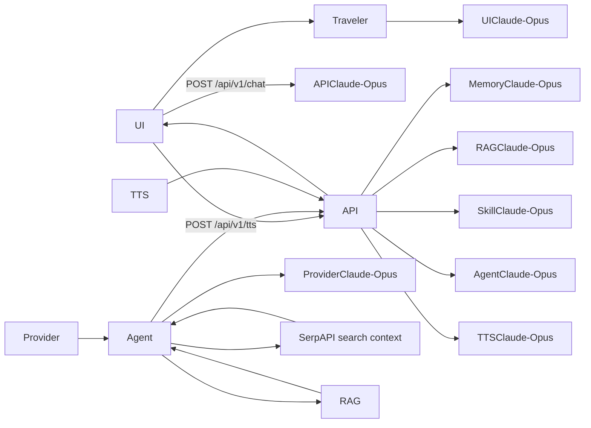

# Voice Travel Agent AI

A voice-first travel agent MVP powered by **Azure nhà cung cấp dịch vụ AI** with production RAG system for verified travel knowledge. Users can speak or type in a **Streamlit** UI; a **FastAPI** backend exposes an OpenAPI-documented API and runs the agent logic. A **travel consultant skill** defines how the agent recommends destinations, hotels, weather, and food, and the backend can enrich answers with **SerpAPI** search context and **RAG** verified knowledge base, and generates spoken replies through a local backend TTS endpoint.

## Status

**Phase 7 Complete** — Production RAG system with hybrid search, travel-domain chunking, and Chroma/Azure AI Search support.

## Stack

| Layer | Technology |
|-------|------------|
| UI | Streamlit (Python) |
| API | FastAPI + OpenAPI |
| Agent | Azure nhà cung cấp dịch vụ AI chat completions |
| Retrieval | RAG (Chroma/Azure AI Search) + SerpAPI search context |
| TTS | Local backend TTS (`pyttsx3`) returning `audio/wav` — configurable via `TTS_ENGINE` |
| Guidance | Travel consultant skill file (`skills/travel-consultant/SKILL.md`) |

## Architecture



## RAG System

The RAG system provides verified travel knowledge with citations:

- **Hybrid Search**: Combines semantic similarity with keyword matching for exact terms (airport codes: SFO, JFK; hotel names: Marriott, Hilton)
- **Travel-Domain Chunking**: Intelligent chunking rules for hotels, destinations, visa rules, and transport info
- **Dual Providers**: Chroma (local development) or Azure AI Search (production)
- **Graceful Fallback**: Degrades to SerpAPI-only if RAG is disabled or unavailable

### RAG Configuration

```bash
# .env
RAG_ENABLED=true
RAG_PROVIDER=chroma  # or "azure" for production
# Chroma settings (local)
CHROMA_HOST=localhost
CHROMA_PORT=8001
# Azure AI Search settings (production)
AZURE_SEARCH_ENDPOINT=https://your-search.search.windows.net
AZURE_SEARCH_API_KEY=your-key
INDEX_NAME=travel-docs
RETRIEVAL_TOP_K=10
CHUNK_SIZE=600
```

## Project layout

```
travel-advisor/
├── README.md
├── AGENTS.md
├── .env.example
├── requirements.txt
├── specs/
├── skills/travel-consultant/SKILL.md
├── backend/
│   ├── __init__.py
│   ├── main.py
│   ├── config.py
│   ├── schemas.py
│   ├── skill_loader.py
│   ├── agent.py
│   ├── memory.py
│   ├── tts.py
│   ├── serpapi_client.py
│   └── rag/
│       ├── __init__.py
│       ├── config.py
│       ├── document_store.py
│       ├── chunkers.py
│       ├── retriever.py
│       └── rag_client.py
├── frontend/
└── tests/
    ├── test_chat.py
    ├── test_health.py
    └── rag/
        ├── test_rag_client.py
        └── test_retriever.py
```

## Prerequisites

- Python 3.11+
- Azure nhà cung cấp dịch vụ AI access
- SerpAPI credentials if you want destination/hotel/weather/food enrichment
- Platform TTS support for `pyttsx3` (Windows Speech API, macOS `nsss`, Linux `espeak`)
- Redis server (local or hosted, with automatic graceful in-memory dictionary fallback)
- Chroma server for local RAG (`chroma run --port 8001`) or Azure AI Search for production

## Getting started

1. Create and activate a Python virtual environment.
2. Install dependencies:
   - `pip install -r requirements.txt`
3. Copy `.env.example` to `.env` and set Azure nhà cung cấp dịch vụ AI, SerpAPI, TTS, and Redis variables.
4. Start Redis locally (e.g., using Docker):
   - `docker run --name travel-redis -p 6379:6379 -d redis`
5. Optional: Start Chroma for local RAG:
   - `chroma run --host localhost --port 8001`
6. Make sure your Azure nhà cung cấp dịch vụ AI deployment name matches `AZURE_OPENAI_DEPLOYMENT`.
7. Start API:
   - `uvicorn backend.main:app --reload --host 0.0.0.0 --port 8000`
8. Start UI:
   - `streamlit run frontend/app.py`
9. Open the Streamlit URL and ask for trip advice.

## RAG Ingestion

To add documents to the knowledge base:

```python
from backend.rag.document_store import DocumentStore, DocumentChunk

store = DocumentStore()

# Add travel guides
chunks = [
    DocumentChunk(
        content="Tokyo has excellent hotels ranging from budget to luxury. Shinjuku and Shibuya are popular areas for tourists.",
        metadata={"type": "destination", "location": "Tokyo"}
    ),
    DocumentChunk(
        content="Japan visa: Citizens of US, EU, UK can enter as tourists for 90 days without visa.",
        metadata={"type": "visa", "country": "Japan"}
    ),
]

store.store_documents(chunks)
```

## API

- Health check: `GET /health`
- Chat endpoint: `POST /api/v1/chat`
- TTS endpoint: `POST /api/v1/tts`
- Docs: `/docs`

## Testing

- Run all tests: `pytest`
- Run RAG tests: `pytest tests/rag/`
- Run chat tests: `pytest tests/test_chat.py`

## Documentation

| File | Purpose |
|------|---------|
| [AGENTS.md](AGENTS.md) | How AI agents should work in this repo |
| Claude-Opus(specs/product-spec.md) | What we are building |
| Claude-Opus(specs/implementation-plan.md) | How we build it |
| Claude-Opus(specs/test-plan.md) | How we verify it |
| Claude-Opus(specs/change-log.md) | Spec and product changes |