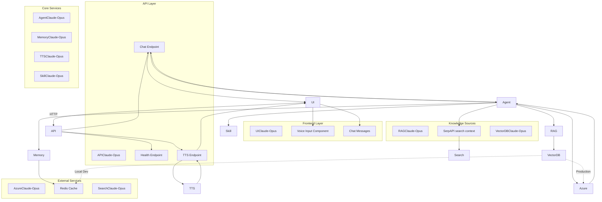
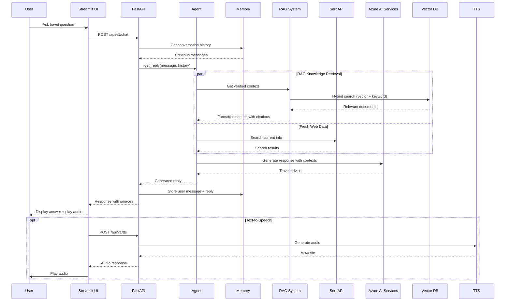

# Voice Travel Agent AI

A voice-first travel agent MVP powered by **Azure AI Services**. Users can speak or type in a **Streamlit** UI; a **FastAPI** backend exposes an OpenAPI-documented API and runs the agent logic. A **travel consultant skill** defines how the agent recommends destinations, hotels, weather, and food, and the backend can enrich answers with **RAG verified knowledge** and **SerpAPI** search context, and generates spoken replies through a local backend TTS endpoint.

## Status

**Phase 7 RAG System Implemented** — Production RAG with hybrid retrieval (vector + keyword), travel-domain chunking, Chroma/Azure AI Search support.

## Stack

| Layer | Technology |
|-------|------------|
| UI | Streamlit (Python) |
| API | FastAPI + OpenAPI |
| Agent | Azure AI Services chat completions |
| Retrieval | **RAG (hybrid vector + keyword)** + SerpAPI search context |
| Knowledge | Vector database (Chroma/Azure AI Search) with travel documents |
| TTS | Local backend TTS (`pyttsx3`) returning `audio/wav` — configurable via `TTS_ENGINE` |
| Guidance | Travel consultant skill file (`skills/travel-consultant/SKILL.md`) |

## Architecture

### System Overview



### Request Flow Sequence



## Project layout

```
travel-advisor/
├── README.md
├── AGENTS.md
├── .env.example
├── requirements.txt
├── specs/
├── skills/travel-consultant/SKILL.md
├── backend/
│   ├── __init__.py
│   ├── main.py
│   ├── config.py
│   ├── agent.py
│   ├── memory.py
│   ├── rag/
│   │   ├── __init__.py
│   │   ├── config.py
│   │   ├── document_store.py
│   │   ├── chunkers.py
│   │   ├── retriever.py
│   │   └── rag_client.py
├── frontend/
└── tests/
    └── rag/
```

## Prerequisites

- Python 3.11+
- Azure AI Services access
- SerpAPI credentials (optional, for fresh web data)
- Platform TTS support for `pyttsx3` (Windows Speech API, macOS `nsss`, Linux `espeak`)
- Redis server (optional, with automatic graceful in-memory dictionary fallback)
- **RAG**: Chroma server (local) or Azure AI Search (production)

## Getting started

1. Create and activate a Python virtual environment.
2. Install dependencies:
   - `pip install -r requirements.txt`
3. Copy `.env.example` to `.env` and set Azure AI Services, SerpAPI, TTS, and Redis variables.
4. Start Redis locally (e.g., using Docker):
   - `docker run --name travel-redis -p 6379:6379 -d redis`
5. **(Optional) Start Chroma server for RAG:**
   - `chroma run --host localhost --port 8001`
6. Make sure your Azure AI Services deployment name matches `AZURE_OPENAI_DEPLOYMENT`.
7. Start API:
   - `uvicorn backend.main:app --reload --host 0.0.0.0 --port 8000`
8. Start UI:
   - `streamlit run frontend/app.py`
9. Open the Streamlit URL and ask for trip advice.

## RAG System (Phase 7)

### Quick Start with Local RAG

**1. Enable RAG in `.env`:**
```bash
# Local development with Chroma
RAG_ENABLED=true
RAG_PROVIDER=chroma
RAG_RETRIEVAL_TOP_K=10

# Production with Azure AI Search
RAG_ENABLED=true
RAG_PROVIDER=azure
RAG_AZURE_SEARCH_ENDPOINT=https://your-search.search.windows.net
RAG_AZURE_SEARCH_API_KEY=your-api-key
RAG_INDEX_NAME=travel-docs
```

**2. Start Chroma server (for local development):**
```bash
chroma run --host localhost --port 8001
```

**3. Ingest travel documents:**
```python
from backend.rag import DocumentStore

store = DocumentStore()
documents = [
    "Tokyo has excellent hotels ranging from budget to luxury. Shinjuku and Shibuya are popular areas.",
    "Japan visa: Citizens of US, EU, UK can enter as tourists for 90 days without visa.",
    "Best time to visit Tokyo: March-May (cherry blossom) or September-November (autumn colors)."
]
store.store_documents(documents, metadata=[{"type": "guide"}]*3)
```

### Hybrid Retrieval

The RAG system combines:

- **Vector search** for semantic similarity (e.g., "beach resort recommendations")
- **Keyword search** for exact terms (e.g., "SFO", "Marriott", "Hilton")

## API

- Health check: `GET /health`
- Chat endpoint: `POST /api/v1/chat`
- TTS endpoint: `POST /api/v1/tts`
- Docs: `/docs`

## Testing

- Run all tests: `pytest`
- Run RAG tests: `pytest tests/rag/`
- Run chat tests: `pytest tests/test_chat.py`

## Documentation

| File | Purpose |
|------|---------|
| [AGENTS.md](AGENTS.md) | How AI agents should work in this repo |
| Claude-Opus(specs/product-spec.md) | What we are building |
| Claude-Opus(specs/implementation-plan.md) | How we build it |
| Claude-Opus(specs/test-plan.md) | How we verify it |
| Claude-Opus(specs/change-log.md) | Spec and product changes |