# Class Diagram Specification — Voice Travel Agent

This document outlines the main classes, schemas, and configurations of the Voice Travel Agent system.
Last updated: 2026-06-14 (synced to current source code).

---

## Class Diagram

### Core Configuration

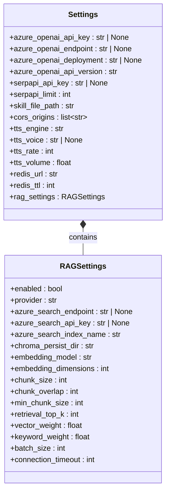

### API Schemas

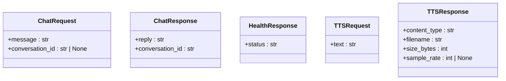

### SerpAPI Layer

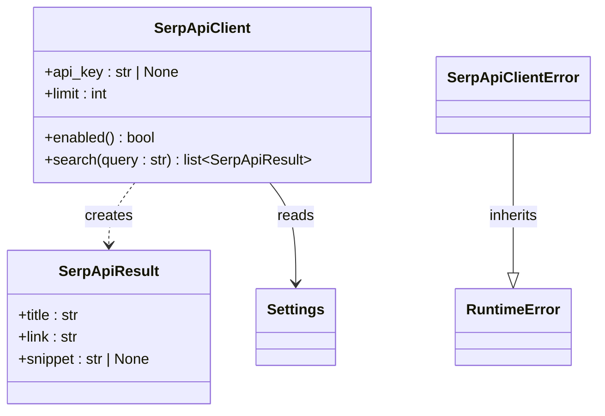

### Agent Layer

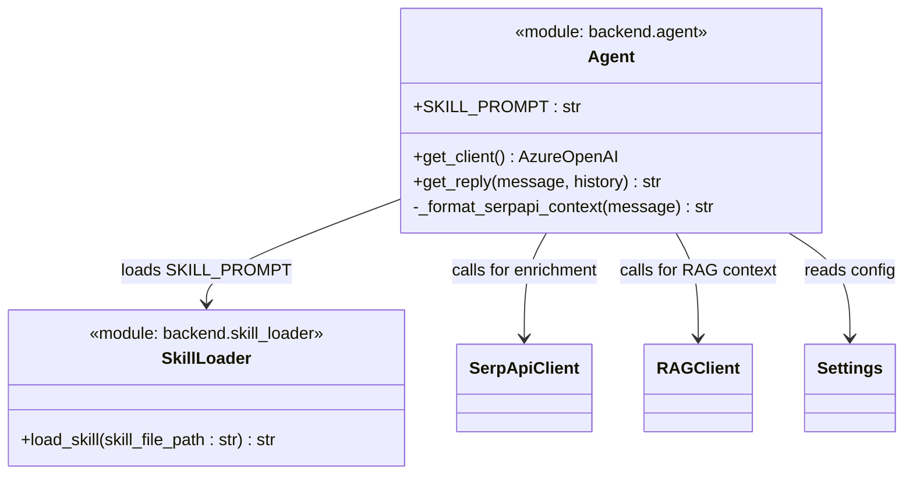

### Memory Layer

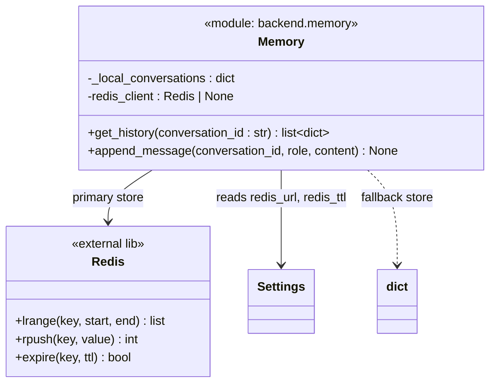

### TTS Layer

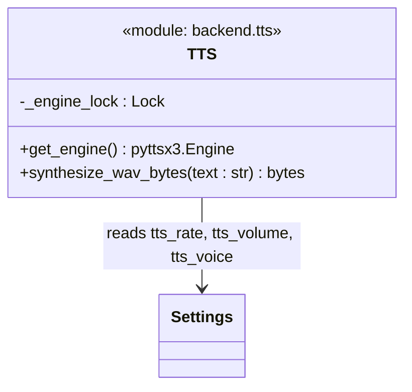

### FastAPI Application

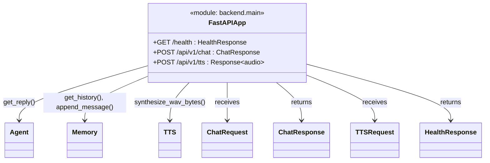

### RAG Subsystem

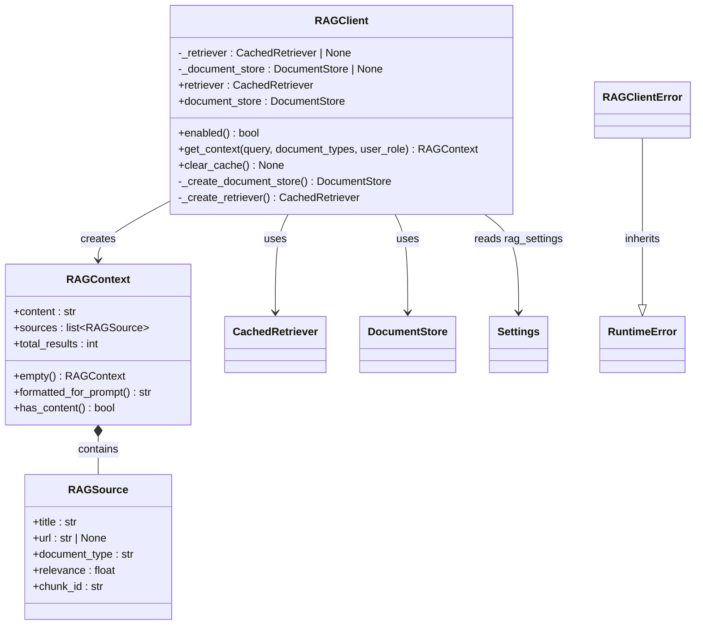

### RAG Document Store

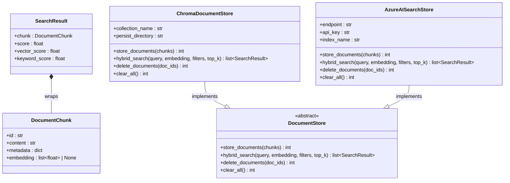

### RAG Retriever

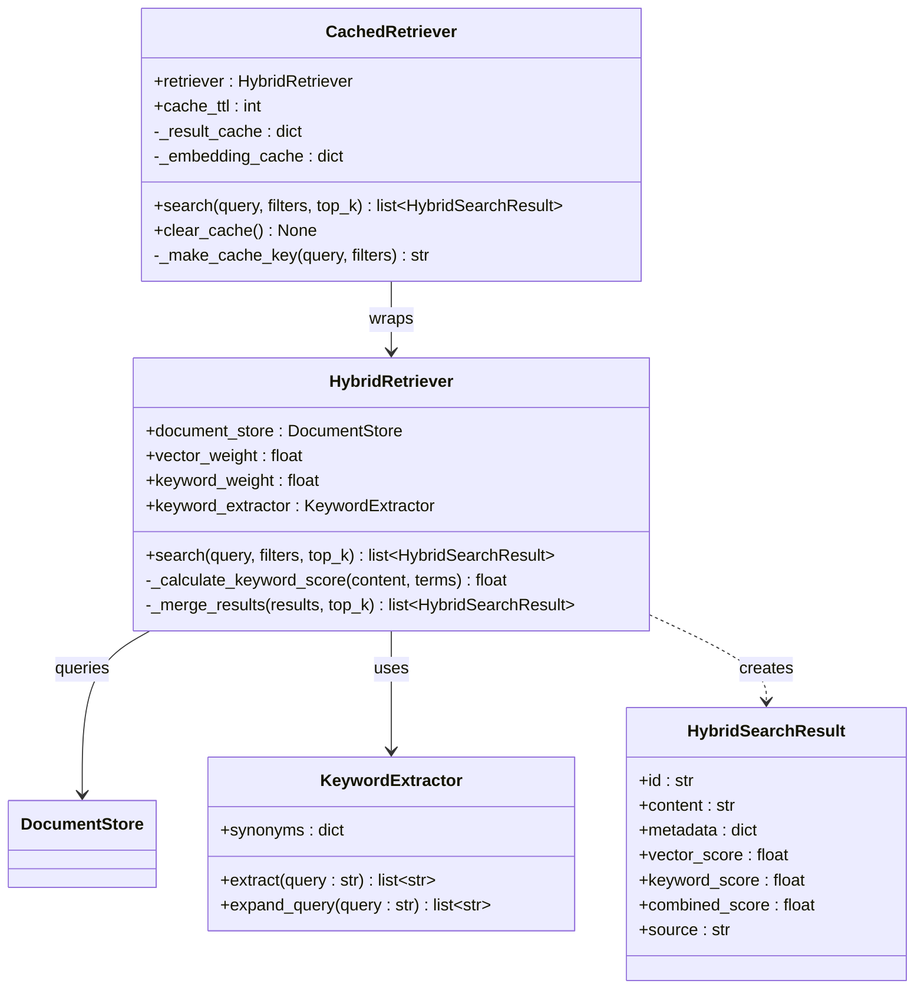

### RAG Chunkers

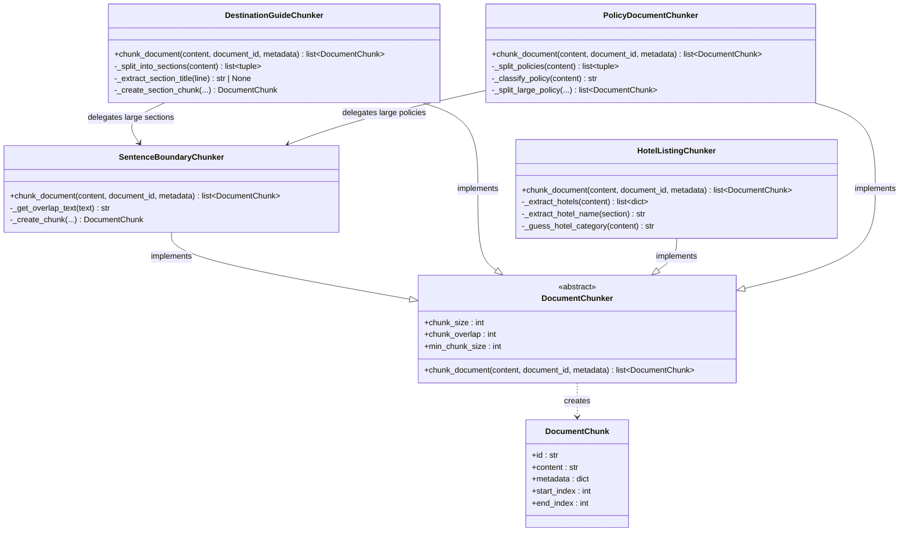

---

## Descriptions

### 1. Configuration & Settings

- **[Settings](file:///d:/travel-advisor/backend/config.py#L28-L50)**: Reads all project settings from env files. Now includes a nested `rag_settings: RAGSettings` field.
- **[RAGSettings](file:///d:/travel-advisor/backend/config.py#L15-L25)**: RAG-specific configuration (provider, Azure Search, Chroma, embeddings, chunking, retrieval). Also separately defined in [rag/config.py](file:///d:/travel-advisor/backend/rag/config.py) with more detail (embedding dimensions, performance settings).

### 2. Request/Response Schemas (Pydantic Models)

- **[ChatRequest](file:///d:/travel-advisor/backend/schemas.py#L6-L8)**: Incoming chat request. Strips whitespace, requires at least 1 character.
- **[ChatResponse](file:///d:/travel-advisor/backend/schemas.py#L11-L13)**: Holds reply content and matching conversation ID.
- **[HealthResponse](file:///d:/travel-advisor/backend/schemas.py#L16-L17)**: Body of the `/health` endpoint.
- **[TTSRequest](file:///d:/travel-advisor/backend/schemas.py#L20-L21)**: Text to be synthesized to audio.
- **[TTSResponse](file:///d:/travel-advisor/backend/schemas.py#L24-L29)**: Audio metadata (content type, filename, size, sample rate).

### 3. SerpAPI Client Layer

- **[SerpApiClient](file:///d:/travel-advisor/backend/serpapi_client.py#L21-L58)**: Calls SerpAPI Google Search to enrich travel agent responses. Enabled only when API key is configured.
- **[SerpApiResult](file:///d:/travel-advisor/backend/serpapi_client.py#L11-L14)**: Dataclass encapsulating organic search result (title, link, snippet).
- **[SerpApiClientError](file:///d:/travel-advisor/backend/serpapi_client.py#L17-L18)**: Raised on network or parsing failures.

### 4. Agent Layer

- **[Agent module](file:///d:/travel-advisor/backend/agent.py)**: Loads the skill prompt from `SKILL.md`, enriches messages via SerpAPI and RAG context, then calls Azure OpenAI `chat.completions` to produce replies.
- **[SkillLoader](file:///d:/travel-advisor/backend/skill_loader.py)**: Reads `skills/travel-consultant/SKILL.md` from disk and returns its content as a string for injection into the system prompt.

### 5. Memory Layer

- **[Memory module](file:///d:/travel-advisor/backend/memory.py)**: Manages per-`conversation_id` message history. Primary store is Redis (list-based, with TTL). Falls back to an in-memory `defaultdict` when Redis is unavailable.

### 6. TTS Layer

- **[TTS module](file:///d:/travel-advisor/backend/tts.py)**: Uses `pyttsx3` to synthesize speech from text. The engine is lazily cached via `@lru_cache`. Thread-safe via a `Lock`. Returns raw WAV bytes.

### 7. FastAPI Application

- **[main.py](file:///d:/travel-advisor/backend/main.py)**: Exposes three endpoints:
  - `GET /health` → `HealthResponse`
  - `POST /api/v1/chat` → receives `ChatRequest`, calls `get_reply()`, persists history, returns `ChatResponse`
  - `POST /api/v1/tts` → receives `TTSRequest`, calls `synthesize_wav_bytes()`, returns raw `audio/wav`

### 8. RAG Subsystem (`backend/rag/`)

- **[RAGClient](file:///d:/travel-advisor/backend/rag/rag_client.py#L63-L215)**: Top-level RAG orchestrator. Checks if RAG is enabled/configured, lazily creates the document store and retriever, retrieves context as `RAGContext` with source citations.
- **[RAGContext](file:///d:/travel-advisor/backend/rag/rag_client.py#L32-L60)**: Formatted retrieval context with source list and helpers for prompt injection.
- **[RAGSource](file:///d:/travel-advisor/backend/rag/rag_client.py#L22-L28)**: Source citation (title, URL, document type, relevance score).
- **[RAGClientError](file:///d:/travel-advisor/backend/rag/rag_client.py#L16-L18)**: Raised when RAG configuration or retrieval fails.

#### Document Store

- **[DocumentStore](file:///d:/travel-advisor/backend/rag/document_store.py#L30-L57)**: Abstract base class defining `store_documents`, `hybrid_search`, `delete_documents`, `clear_all`.
- **[ChromaDocumentStore](file:///d:/travel-advisor/backend/rag/document_store.py#L60-L165)**: Local ChromaDB implementation for development.
- **[AzureAISearchStore](file:///d:/travel-advisor/backend/rag/document_store.py#L168-L306)**: Azure AI Search implementation for production.
- **[DocumentChunk](file:///d:/travel-advisor/backend/rag/document_store.py#L13-L18)**: A chunk of text with metadata and optional embedding vector.
- **[SearchResult](file:///d:/travel-advisor/backend/rag/document_store.py#L22-L28)**: A search hit containing a `DocumentChunk` plus vector/keyword scores.

#### Retriever

- **[HybridRetriever](file:///d:/travel-advisor/backend/rag/retriever.py#L99-L232)**: Combines vector search with travel-specific keyword scoring, merges/deduplicates results, and returns `HybridSearchResult` list sorted by combined score.
- **[CachedRetriever](file:///d:/travel-advisor/backend/rag/retriever.py#L235-L299)**: Wraps `HybridRetriever` with an in-memory TTL cache keyed on a hash of query + filters.
- **[KeywordExtractor](file:///d:/travel-advisor/backend/rag/retriever.py#L27-L96)**: Extracts and expands travel-domain keywords (synonyms, hotel brands, airport codes) from queries.
- **[HybridSearchResult](file:///d:/travel-advisor/backend/rag/retriever.py#L16-L24)**: Combined result with vector score, keyword score, combined score, and source metadata.

#### Chunkers

- **[DocumentChunker](file:///d:/travel-advisor/backend/rag/chunkers.py#L34-L55)**: Abstract base for all chunkers (chunk_size, chunk_overlap, min_chunk_size).
- **[SentenceBoundaryChunker](file:///d:/travel-advisor/backend/rag/chunkers.py#L58-L155)**: General-purpose chunker respecting sentence boundaries with overlap.
- **[DestinationGuideChunker](file:///d:/travel-advisor/backend/rag/chunkers.py#L158-L288)**: Splits destination guides by markdown/heading sections; delegates large sections to `SentenceBoundaryChunker`.
- **[HotelListingChunker](file:///d:/travel-advisor/backend/rag/chunkers.py#L291-L379)**: Extracts individual hotel blocks and guesses categories (luxury/budget/mid-range).
- **[PolicyDocumentChunker](file:///d:/travel-advisor/backend/rag/chunkers.py#L382-L508)**: Preserves policy integrity; delegates large policies to `SentenceBoundaryChunker` with larger overlap.
- **`create_chunker(document_type)`**: Factory returning the appropriate chunker for `destination`, `hotel`, `policy`, or `general` content.

---

## Known Issues (as of 2026-06-14)

> [!WARNING]
> The following code bugs were found while syncing this diagram. They are **not yet fixed** in source:

1. **`rag_client.py` import error** — [line 10](file:///d:/travel-advisor/backend/rag/rag_client.py#L10) imports `ChromaStore` from `document_store`, but the class is named **`ChromaDocumentStore`**. This causes an `ImportError` at runtime.

2. **`retriever.py` missing `settings` singleton** — [line 9](file:///d:/travel-advisor/backend/rag/retriever.py#L9) does `from .config import settings`, but `rag/config.py` only defines the `RAGSettings` class — there is no `settings` singleton in that module. Should import from `backend.config` instead (i.e., `from ..config import settings`).

3. **Missing `redis` module in test environment** — Tests fail because `redis` is listed in `requirements.txt` but not installed in the active `.venv`. Run `pip install redis` inside the virtual environment.
