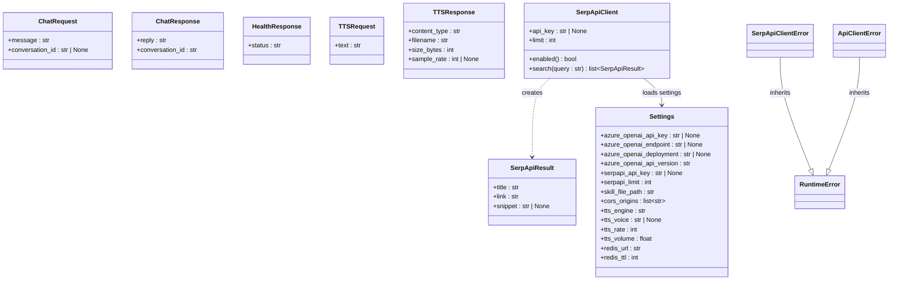

# Class Diagram Specification — Voice Travel Agent

This document outlines the main classes, schemas, and configurations of the Voice Travel Agent system.

## Class Diagram

## Descriptions

### 1. Configuration & Settings
- **[Settings](file:///Users/macmini/Desktop/AIApp/travel-advisor/backend/config.py#L15-L29)**: Responsible for reading all project settings from env files (`.env`, `.env.example`).

### 2. Request/Response Schemas (Pydantic Models)
- **[ChatRequest](file:///Users/macmini/Desktop/AIApp/travel-advisor/backend/schemas.py#L6-L8)**: Used for incoming chat requests. Strips whitespace and requires at least 1 character.
- **[ChatResponse](file:///Users/macmini/Desktop/AIApp/travel-advisor/backend/schemas.py#L11-L13)**: Holds reply content and matching conversation ID.
- **[HealthResponse](file:///Users/macmini/Desktop/AIApp/travel-advisor/backend/schemas.py#L16-L17)**: Body of the `/health` endpoint.
- **[TTSRequest](file:///Users/macmini/Desktop/AIApp/travel-advisor/backend/schemas.py#L20-L21)**: Stores text string to be synthesized.
- **[TTSResponse](file:///Users/macmini/Desktop/AIApp/travel-advisor/backend/schemas.py#L24-L29)**: Describes the generated audio metadata structure.

### 3. SerpAPI Client Layer
- **[SerpApiClient](file:///Users/macmini/Desktop/AIApp/travel-advisor/backend/serpapi_client.py#L21-L58)**: Calls SerpAPI Google Search API. Retrieves top pages to enrich the travel agent's response.
- **[SerpApiResult](file:///Users/macmini/Desktop/AIApp/travel-advisor/backend/serpapi_client.py#L11-L14)**: Dataclass encapsulating organic Google Search results (title, link, snippet).
